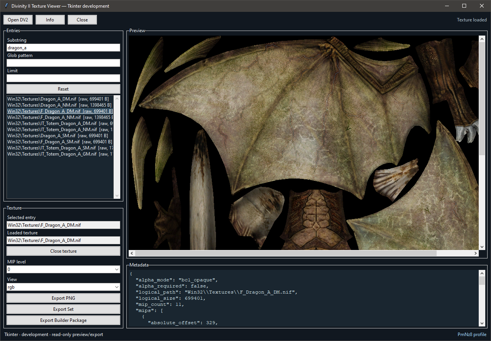
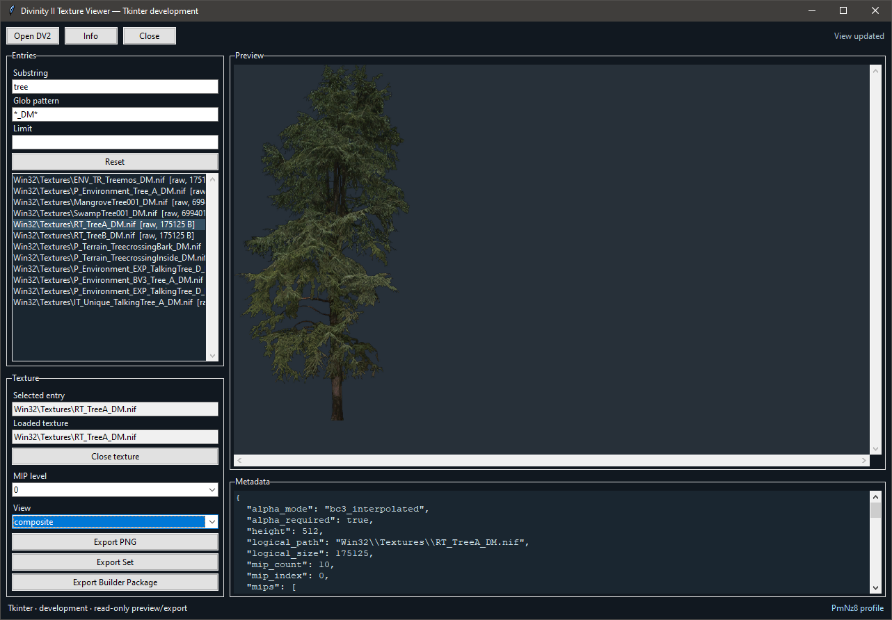

# Divinity II Texture Viewer 0.1.1

Experimental Windows x64 release by [PmNz8](https://github.com/PmNz8). This
read-only viewer/exporter covers Divinity II: Developer's Cut DV2 archives,
including compatible mod archives; it is not affiliated with the game developer
or publisher. No raw game assets are included; screenshots are illustrative documentation.

Developed and tested exclusively with the **GOG edition of Divinity II:
Developer's Cut**. Compatibility with other editions or storefront versions
has not been verified.

## What it does

- Finds supported standalone BC1, BC2 and BC3 texture wrappers in a DV2 archive.
- Shows existing mip levels at 1:1, with RGB, alpha and composite views.
- Filters the live result list by path substring, glob pattern and result limit.
- Exports a selected view/mip as PNG, a complete texture set, or a Builder Package; source archives are never modified.

Export a Builder Package to prepare textures for the companion
[DKS Patch Builder](https://github.com/PmNz8/divinity2-dks-patch-builder),
which compiles texture changes into a separate `DKS_Patch.dv2` archive.

## Quick start

1. Download the [0.1.1 release](https://github.com/PmNz8/divinity2-texture-viewer/releases/tag/v0.1.1), extract the entire ZIP to a writable local folder, and launch `TextureViewer.exe`.
2. Open a DV2 archive, let the compatibility scan finish, filter or open a texture, then choose one of the three export actions.

Keep `_internal`, `LICENSES`, `docs/images` and the accompanying files together;
do not run directly inside the ZIP. Python, UV, Node.js, .NET and WebView2 are not required.
See [USAGE.md](USAGE.md) for workflow, limits and diagnostics; see [BUILD.md](BUILD.md) for a source build.

## Earlier development screenshots

These are earlier-development UI screenshots for orientation, not pixel-exact captures of the current 0.1.1 release; the second image is composite, not a normal-map view.

The screenshots are illustrative documentation, not raw game-asset distribution; copyright in depicted game-derived content remains with the respective rights holders.

## License

Copyright (C) 2026 PmNz8. Own code: **AGPL-3.0-only**; see
[`LICENSE`](LICENSE), [`THIRD_PARTY_NOTICES.md`](THIRD_PARTY_NOTICES.md) and
[`LICENSES`](LICENSES). This program comes with **ABSOLUTELY NO WARRANTY**.
The license does not grant rights to game assets you export.

### Licensing of exported content

This tool's own code is licensed under GNU AGPLv3 (`AGPL-3.0-only`). Merely using
the tool to create, modify, or export content does not automatically place that
content under the AGPLv3.

This clarification does not override licenses already applicable to the content
or to any tool code incorporated into it.

Content derived from Divinity II game assets remains subject to the rights of
the respective copyright holders. This tool does not grant permission to
redistribute those assets.

Mod authors may license their own original contributions only to the extent
that they hold the necessary rights, without overriding rights in underlying
game assets.
